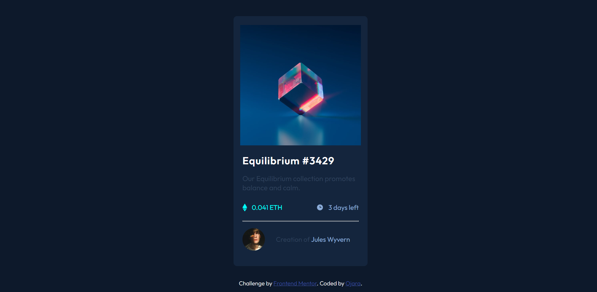

# Frontend Mentor - NFT preview card component solution

This is a solution to the [NFT preview card component challenge on Frontend Mentor](https://www.frontendmentor.io/challenges/nft-preview-card-component-SbdUL_w0U). Frontend Mentor challenges help you improve your coding skills by building realistic projects. 
## Table of contents
- [Overview](#overview)
  - [The challenge](#the-challenge)
  - [Screenshot](#screenshot)
  - [Links](#links)
  - [Built with](#built-with)
  - [Author](#author)

## Overview
Hi, there....Thanks for checking out this front-end coding challenge.
I'm Favour

### The challenge
I tried to solve this challenge i found on[Frontend Mentor](https://www.frontendmentor.io/challenges/nft-preview-card-component-SbdUL_w0U).

### Screenshot

### Links
- Solution URL: [Add solution URL here](https://frontendmentor-nft-preview-card-ojara.netlify.app/)
- Live Site URL: [Add live site URL here](https://frontendmentor-nft-preview-card-ojara.netlify.app/)

### Built with

- Semantic HTML5 markup
- CSS custom properties
- Flexbox

## Author

- Website - [Ojara](https://www.linkedin.com/in/okereke-favour-230234198)
- Frontend Mentor - [@Ojara27](https://www.frontendmentor.io/profile/Ojara27)
- Twitter - [@FavourOkereke14](https://twitter.com/FavourOkereke14)
